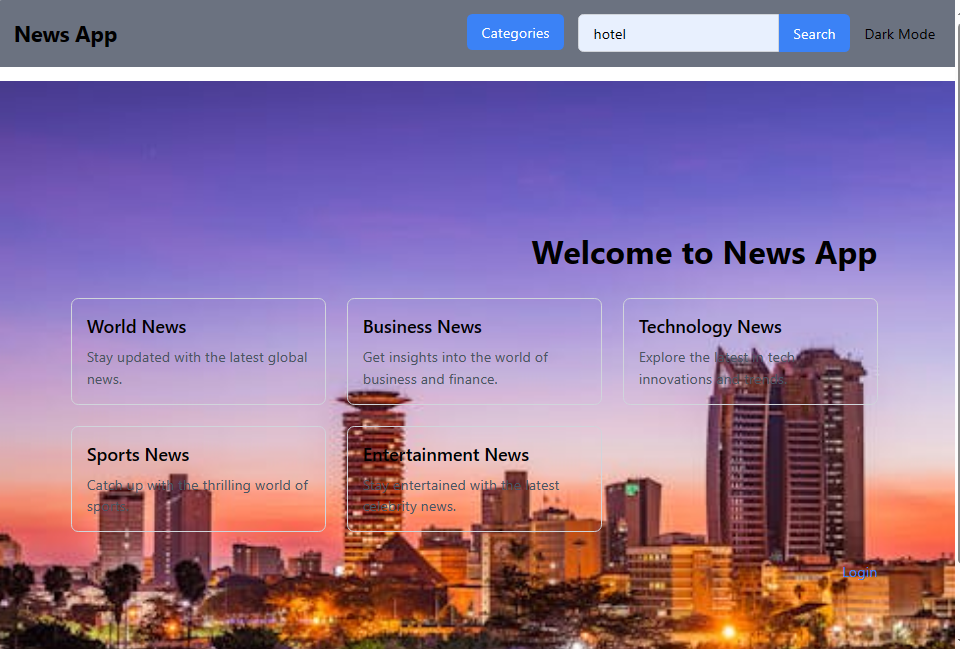

# News Web Application

This is a simple web application that allows users to browse and read the latest news articles from various categories.

## Minimum viable Products

- View top headlines from different news categories such as General, Business, Entertainment, Health, Science, Sports, and Technology.
- Toggle between dark mode and light mode for comfortable reading.
- Click on news articles to read more details on the original source website.

### Features

1. News Articles
2. User Registration/Login
3. Categories and Tags
4. Dark and Light Mode
5. Home Page

## Technologies Used

- **Frontend**: React.js, React Router DOM, Tailwind CSS
- **API**: [News API](https://gnews.io/api/v4/top-headlines)
- **Deployment**: [Vercel](https://www.vercel.com/)

## License

This project is licensed under the [MIT License](LICENSE).

# Author
[Uvyne Rop](https://github.com/uvyne-rop)
