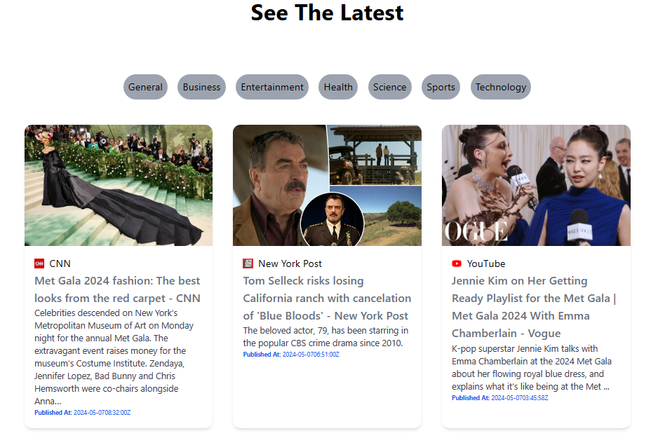

# News Web Application

This is a simple web application that allows users to browse and read the latest news articles from various categories.

## Features

- View top headlines from different news categories such as General, Business, Entertainment, Health, Science, Sports, and Technology.
- Toggle between dark mode and light mode for comfortable reading.
- Click on news articles to read more details on the original source website.

## Technologies Used

- **Frontend**: React.js, React Router DOM, Tailwind CSS
- **API**: [News API](https://newsapi.org/)
- **Deployment**: [Netlify](https://www.netlify.com/)
